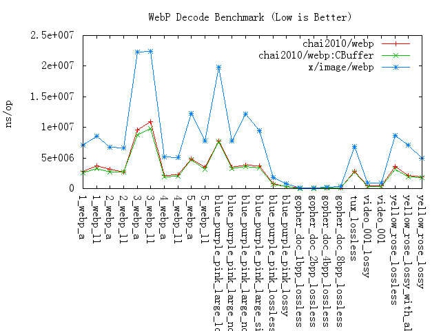

webp
=====

```
██╗    ██╗███████╗██████╗ ██████╗
██║    ██║██╔════╝██╔══██╗██╔══██╗
██║ █╗ ██║█████╗  ██████╔╝██████╔╝
██║███╗██║██╔══╝  ██╔══██╗██╔═══╝
╚███╔███╔╝███████╗██████╔╝██║
 ╚══╝╚══╝ ╚══════╝╚═════╝ ╚═╝
```


[](https://github.com/chai2010/webp/actions/workflows/test.yml)
[](https://pkg.go.dev/github.com/chai2010/webp)
[](https://github.com/chai2010/webp/releases)
[](https://github.com/chai2010/webp/blob/master/LICENSE)

Benchmark
=========




Install
=======

Install `GCC` or `MinGW` ([download here](http://tdm-gcc.tdragon.net/download)) at first,
and then run these commands:

1. `go get github.com/chai2010/webp`
2. `go run hello.go`


Example
=======

This is a simple example:

```Go
package main

import (
	"bytes"
	"fmt"
	"io/ioutil"
	"log"

	"github.com/chai2010/webp"
)

func main() {
	var buf bytes.Buffer
	var width, height int
	var data []byte
	var err error

	// Load file data
	if data, err = ioutil.ReadFile("./testdata/1_webp_ll.webp"); err != nil {
		log.Println(err)
	}

	// GetInfo
	if width, height, _, err = webp.GetInfo(data); err != nil {
		log.Println(err)
	}
	fmt.Printf("width = %d, height = %d\n", width, height)

	// GetMetadata
	if metadata, err := webp.GetMetadata(data, "ICCP"); err != nil {
		fmt.Printf("Metadata: err = %v\n", err)
	} else {
		fmt.Printf("Metadata: %s\n", string(metadata))
	}

	// Decode webp
	m, err := webp.Decode(bytes.NewReader(data))
	if err != nil {
		log.Println(err)
	}

	// Encode lossless webp
	if err = webp.Encode(&buf, m, &webp.Options{Lossless: true}); err != nil {
		log.Println(err)
	}
	if err = ioutil.WriteFile("output.webp", buf.Bytes(), 0666); err != nil {
		log.Println(err)
	}
    
    fmt.Println("Save output.webp ok")
}
```

Decode and Encode as RGB format:

```Go
m, err := webp.DecodeRGB(data)
if err != nil {
	log.Fatal(err)
}

data, err := webp.EncodeRGB(m)
if err != nil {
	log.Fatal(err)
}
```

Give a Star! ⭐
===============

If you like project, please give it a star. Thanks!
